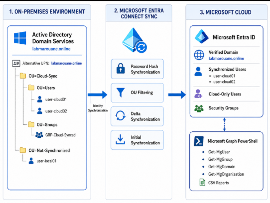

# Week 01 - Azure Identity Foundation

## Overview

Week 01 establishes the identity foundation of my Azure Cloud Architect
learning path.

The objective of this laboratory is to understand the relationship
between an on-premises Active Directory environment and Microsoft
Entra ID, then implement a basic hybrid identity architecture.

The laboratory covers:

- Microsoft Entra ID
- Azure Tenant and Subscription concepts
- Cloud-only users and groups
- Custom domains
- User Principal Name configuration
- Microsoft Entra Connect Sync
- Password Hash Synchronization
- Organizational Unit filtering
- Microsoft Graph PowerShell
- Hybrid identity documentation

---

## Architecture

The laboratory follows this identity architecture:

On-Premises Environment
        │
        │
Active Directory Domain Services
        │
        ├── Users
        ├── Security Groups
        ├── Cloud-Sync OU
        └── Local-Only OU
        │
        ▼
Microsoft Entra Connect Sync
        │
        ├── OU Filtering
        └── Password Hash Synchronization
        │
        ▼
Microsoft Entra ID
        │
        ├── Verified Domain
        ├── Synchronized Users
        ├── Cloud-Only Users
        └── Security Groups
        │
        ▼
Microsoft Graph PowerShell

Missions
Mission	Topic	Status
Mission 01	Tenant and Microsoft Entra ID	
Mission 02	Custom Domain and UPN	
Mission 03	Microsoft Entra Connect Sync	
Mission 04	OU Filtering and Synchronization	
Mission 05	Microsoft Graph PowerShell	
Mission 06	Final Documentation and Architecture	

Laboratory Environment

The laboratory includes:

Active Directory Domain Services
Microsoft Entra ID
Azure Subscription
Verified custom domain
Microsoft Entra Connect Sync
Password Hash Synchronization
Microsoft Graph PowerShell
Azure PowerShell
Git and GitHub
Draw.io

Main Skills Demonstrated
Microsoft Entra ID administration
Azure identity fundamentals
Active Directory integration
Hybrid identity
Custom domain configuration
UPN configuration
Microsoft Entra Connect Sync
Password Hash Synchronization
Organizational Unit filtering
Microsoft Graph PowerShell
PowerShell automation
Identity auditing
Architecture documentation
Git and GitHub

#####################################

Key Lessons

Microsoft Entra ID is responsible for cloud identity management.

Azure Subscriptions provide resource, billing and governance boundaries.

Active Directory and Microsoft Entra ID can operate together through
hybrid identity synchronization.

A verified UPN suffix simplifies user authentication across on-premises
and cloud environments.

Synchronization scope must be controlled to avoid synchronizing
unnecessary accounts.

Microsoft Graph PowerShell provides modern automation and auditing
capabilities for Microsoft Entra ID.

####################################

Final Architecture

The final architecture diagram is available in:

Mission-06-Final-Documentation/Diagramme.drawio
Mission-06-Final-Documentation/Diagramme.png

To display it directly in GitHub:

