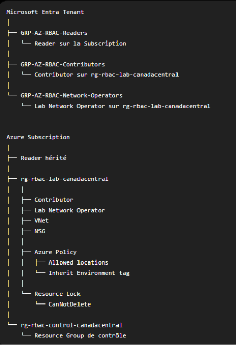

# Week 02 - Azure RBAC and Governance

## Overview

This lab demonstrates how to control access to Azure resources
and apply governance mechanisms in an enterprise environment.

The implementation covers:

- Microsoft Entra security groups
- Azure RBAC role assignments
- RBAC scopes and inheritance
- Least privilege
- Azure Policy
- Resource tags
- Resource Locks
- Custom RBAC roles
- RBAC auditing with PowerShell

---

## Architecture

---

## Azure Environment

The laboratory contains two Resource Groups:

- `rg-rbac-lab-canadacentral`
- `rg-rbac-control-canadacentral`

The first Resource Group contains the authorized laboratory
resources.

The second Resource Group is used to verify scope isolation.

---

## Security Groups

The following Microsoft Entra security groups were created:

| Group | Azure role | Scope |
|---|---|---|
| GRP-AZ-RBAC-Readers | Reader | Subscription |
| GRP-AZ-RBAC-Contributors | Contributor | Lab Resource Group |
| GRP-AZ-RBAC-Network-Operators | Lab Network Operator | Lab Resource Group |

Permissions were assigned to groups instead of individual users.

---

## RBAC Scope and Inheritance

The Reader role was assigned at subscription scope.

It is inherited by:

- Resource Groups
- Azure resources

The Contributor role was assigned only to:

`rg-rbac-lab-canadacentral`

The user could create resources in the authorized Resource Group,
but could not modify resources in the control Resource Group.

---

## Governance Policies

### Allowed locations

An Azure Policy assignment restricts deployments to:

`Canada Central`

Tests performed:

- Deployment in Canada Central: allowed
- Deployment in East US: denied by Azure Policy

### Tag inheritance

The following tag is inherited from the Resource Group:

`Environment = Lab`

A remediation task was used to update existing resources.

---

## Resource Lock

A `CanNotDelete` lock was tested on the laboratory Resource Group.

Results:

- Resource reading: allowed
- Resource modification: allowed
- Resource deletion: denied
- Deletion by Owner: denied until the lock was removed

---

## Custom RBAC Role

A custom role named `Lab Network Operator` was created.

The role allows users to:

- Read resources
- Create and update Virtual Networks
- Create and update subnets
- Create and update Network Security Groups
- Create and update NSG rules

The role does not allow users to:

- Delete network resources
- Create virtual machines
- Create storage accounts
- Assign Azure roles
- Modify resources outside the laboratory scope

---

## PowerShell Automation

The following scripts are included:

### `New-LabNetworkOperatorRole.ps1`

Creates the custom RBAC role with the required permissions.

### `Export-RbacAudit.ps1`

Exports Azure RBAC assignments and identifies whether access is:

- Direct
- Inherited

The script generates a CSV audit report.

---

## Test Results

| Test | Result |
|---|---|
| Reader views Azure resources | Passed |
| Reader creates a resource | Denied |
| Contributor creates a resource in the lab RG | Passed |
| Contributor creates a resource in the control RG | Denied |
| Contributor assigns an Azure role | Denied |
| Policy allows Canada Central | Passed |
| Policy denies East US | Passed |
| Custom role creates a VNet | Passed |
| Custom role creates an NSG | Passed |
| Custom role deletes an NSG | Denied |
| Custom role creates a Storage Account | Denied |
| Custom role assigns an Azure role | Denied |
| PowerShell RBAC audit | Passed |

---

## Key Lessons

Azure RBAC determines:

`Who can perform an action, what action they can perform and at which scope.`

Azure Policy determines:

`Which resource configurations are compliant with organizational standards.`

Resource Locks protect critical resources against accidental
deletion or modification.

The principle of least privilege requires granting only the
permissions necessary to perform a specific task.

---

## Skills Demonstrated

- Microsoft Entra ID
- Azure RBAC
- Azure Governance
- Azure Policy
- Resource Locks
- Custom roles
- PowerShell automation
- Security auditing
- Git and GitHub